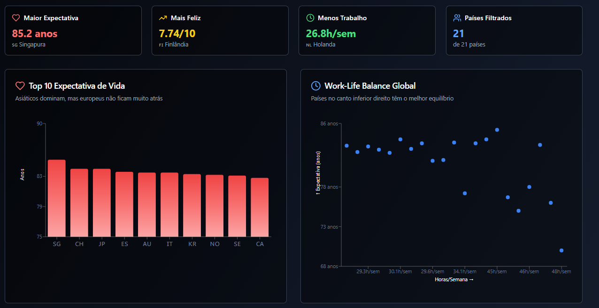

# ⏳ Relógio da Vida

<div align="center">
  
  
  **Uma reflexão visual sobre o tempo e as possibilidades da vida**
  
  [](https://github.com/LauraMattz)
  [](https://reactjs.org/)
  [](https://lovable.dev)
</div>

## 🌟 Sobre o Projeto

O **Relógio da Vida** é uma aplicação web interativa que oferece uma perspectiva única sobre o tempo que vivemos e o tempo que temos pela frente. Através de visualizações envolventes e insights inspiradores, o projeto convida você a refletir sobre como usar melhor cada momento da sua jornada.

### ✨ Funcionalidades Principais

- **📊 Visualização da Vida em Semanas**: Veja sua vida representada em um grid onde cada quadradinho é uma semana
- **⏰ Contador de Tempo Vivido**: Acompanhe em tempo real quantos dias, horas, minutos e segundos você já viveu
- **💡 Insights Inspiradores**: Receba reflexões motivacionais sobre produtividade, hábitos e crescimento pessoal
- **🌍 Comparação Global**: Compare estatísticas de expectativa de vida entre diferentes países
- **📱 Design Responsivo**: Interface otimizada para desktop e dispositivos móveis
- **🛡️ Privacidade Total**: Nenhum dado é armazenado - tudo fica apenas no seu navegador

## 🚀 Demonstração

**[🌐 Acesse a aplicação](https://your-life-in-data.lovable.app)**

### 📸 Screenshots

<div align="center">
  
  <p><em>Dashboard principal com visualização da vida em semanas</em></p>
</div>

## 🛠️ Tecnologias Utilizadas

- **⚛️ React 18** - Biblioteca para interfaces de usuário
- **🎨 TypeScript** - Tipagem estática para JavaScript
- **💨 Vite** - Build tool moderno e rápido
- **🎯 Tailwind CSS** - Framework CSS utilitário
- **🎨 Shadcn/UI** - Componentes de interface elegantes
- **📊 Recharts** - Biblioteca para gráficos e visualizações
- **🔍 Lucide React** - Ícones modernos e minimalistas
- **📱 React Router** - Roteamento para aplicações React

## 🏃‍♂️ Como Executar Localmente

### Pré-requisitos

- Node.js 18+ instalado
- npm ou yarn

### Instalação

```bash
# Clone o repositório
git clone https://github.com/LauraMattz/your-life-in-data.git

# Entre no diretório
cd your-life-in-data

# Instale as dependências
npm install

# Execute a aplicação
npm run dev
```

A aplicação estará disponível em `http://localhost:5173`

## 📁 Estrutura do Projeto

```
src/
├── components/          # Componentes reutilizáveis
│   ├── ui/             # Componentes base do Shadcn/UI
│   ├── InsightCards.tsx     # Cards com insights inspiradores
│   ├── LifeClockCard.tsx    # Contador principal de vida
│   ├── LifeMetricsCard.tsx  # Métricas detalhadas
│   └── ...
├── pages/              # Páginas da aplicação
│   ├── Dashboard.tsx   # Página principal
│   └── ComparacaoGlobalPage.tsx
├── hooks/              # Custom hooks
└── lib/                # Utilitários e configurações
```

## 🎯 Funcionalidades Detalhadas

### 📊 Dashboard Principal
- Grid visual mostrando cada semana da sua vida
- Contadores em tempo real de tempo vivido
- Estatísticas organizadas por anos, meses, semanas, etc.

### 💡 Insights Inspiradores
- Cálculos sobre hábitos de leitura
- Reflexões sobre tempo de tela
- Dicas sobre produtividade e crescimento pessoal

### 🌍 Comparação Global
- Dados de expectativa de vida por país
- Visualizações comparativas
- Contexto global para suas estatísticas pessoais

## 🔒 Privacidade e Segurança

- ✅ **Zero armazenamento de dados**: Todas as informações ficam apenas no seu navegador
- ✅ **Sem cookies de rastreamento**: Não coletamos dados pessoais
- ✅ **Código aberto**: Transparência total sobre como funciona
- ✅ **HTTPS**: Comunicação segura

## 🤝 Contribuindo

Contribuições são sempre bem-vindas! Se você tem uma ideia para melhorar o projeto:

1. Faça um fork do projeto
2. Crie uma branch para sua feature (`git checkout -b feature/AmazingFeature`)
3. Commit suas mudanças (`git commit -m 'Add some AmazingFeature'`)
4. Push para a branch (`git push origin feature/AmazingFeature`)
5. Abra um Pull Request

## 📝 Licença

Este projeto está sob a licença MIT. Veja o arquivo [LICENSE](LICENSE) para mais detalhes.

## 👩‍💻 Sobre a Desenvolvedora

<div align="center">
  
  
  **Laura Mattos**
  
  Transformando ideias em código ✨
  
  [](https://www.linkedin.com/in/lauramattosc/)
  [](https://github.com/LauraMattz)
</div>

---

<div align="center">
  
  **Gostou do projeto? Deixe uma ⭐ no repositório!**
  
  Feito com muito ☕ e 💜 por [Laura Mattos](https://www.linkedin.com/in/lauramattosc/)
  
</div>
